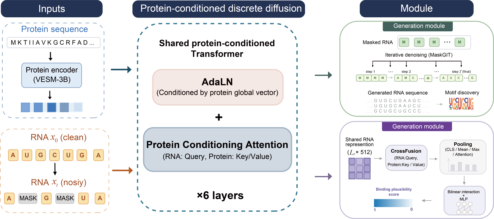

# ProRiboGen

Protein-conditioned RNA generation.

<p align="center">
  
</p>

---

## 1. Environment

Python **3.10** (3.9 and below cannot run this code: `int | None` type hints).  
Always use **`python -m pip`**, not bare `pip`. On clusters, `pip` often still points at system Python 3.8 after `conda activate`.

```bash
git clone https://github.com/yuhuaJiao-tky/ProRiboGen.git
cd ProRiboGen
conda create -n ProRiboGen python=3.10 -y
conda activate ProRiboGen
hash -r
which python
python --version          # must be 3.10.x, path under envs/ProRiboGen
```

Install packages with **that same** `python`. Install **Torch first** from the CUDA 12.4 index (default PyPI may ship CUDA 13), then the rest from `requirements.txt`:

```bash
python -m pip install torch==2.4.1 --index-url https://download.pytorch.org/whl/cu124
python -m pip install -r requirements.txt
python -c "import torch, transformers, h5py; print(torch.__version__, torch.cuda.is_available(), transformers.__version__)"
```

Expected: `2.4.1+cu124 True 4.54.1`.

`requirements.txt` does **not** list `torch` (comment only), so it will not overwrite the cu124 wheel. Do **not** upgrade `transformers` past **4.54.1** while using Torch 2.4.

If `python --version` is still 3.8 after activate, run with the env binary:

```bash
"$CONDA_PREFIX/bin/python" --version
"$CONDA_PREFIX/bin/python" -m pip install -r requirements.txt
```

---

## 2. Weights and data (Hugging Face)

Released checkpoints and data live on Hugging Face (not in this GitHub repo):

**https://huggingface.co/datasets/yuhuajiaotky/ProRiboGen-weights**

Download the pack to **any folder** on your machine:

```bash
huggingface-cli download yuhuajiaotky/ProRiboGen-weights \
  --repo-type dataset \
  --local-dir /any/path/ProRiboGen-weights
```

Pack layout (same as this repo):

```text
<HF_DIR>/
  generation/data/train.csv
  generation/data/test.csv
  generation/data/protein_embeddings.h5
  generation/checkpoints/generator.pt
  classifier/data/train_labeled.csv
  classifier/data/test_labeled.csv
  classifier/checkpoints/classifier.pt
```

From the **ProRiboGen code repo root**, link that folder into the expected paths:

```bash
cd /path/to/ProRiboGen
bash generation/scripts/link_local_data.sh /any/path/ProRiboGen-weights
```

After that, this repo should contain:

| Path | Size | Role |
|------|------|------|
| `generation/checkpoints/generator.pt` | ~597 MB | generator weights |
| `generation/data/train.csv` | ~175 MB | generator train pairs |
| `generation/data/test.csv` | ~25 MB | generator test pairs (33 hold-out proteins) |
| `generation/data/protein_embeddings.h5` | ~1.8 GB | frozen protein embeddings |
| `classifier/checkpoints/classifier.pt` | ~248 MB | classifier weights |
| `classifier/data/train_labeled.csv` | ~51 MB | classifier train table |
| `classifier/data/test_labeled.csv` | ~6.5 MB | classifier test table |

Sampling and classification **read embeddings from the H5**. You do not need VESM/ESM-3B unless you re-encode new proteins. Checksums: `weights/README.md`.

---

## 3. GPUs

Paper settings use **8 GPUs**. **1 GPU and any subset also work.**  
If you change GPU count and do not change accumulation, the **effective batch size** for training changes. Always set `CUDA_VISIBLE_DEVICES` (or `gpu_ids` in the generation train config) to match the cards you actually have.

---

## 4. Generation module

Code and configs live under `generation/`. More detail: `generation/README.md`.

### Train

Effective batch = `batch_size_per_gpu × (number of GPUs) × grad_accum_steps`.  
Default in `generation/config/train.json`: 16 × 8 × 4 = **512**.

GPU list is **only** `"gpu_ids"` in that JSON. Two or more IDs start DDP.

```bash
cd generation
python train.py --config config/train.json
```

Single GPU: set `"gpu_ids": [0]`. To keep effective batch ≈ 512, also set `"grad_accum_steps": 32`.

### Test (sample)

Sampling is **one process per visible GPU** (not DDP). The script counts GPUs from `CUDA_VISIBLE_DEVICES` or `nvidia-smi`. It does **not** assume 8 cards.

```bash
cd generation
bash scripts/run_sample.sh
```

| Setup | Command |
|-------|---------|
| All GPUs on this node (8-GPU node → 8 jobs) | `bash scripts/run_sample.sh` |
| Four cards | `CUDA_VISIBLE_DEVICES=0,1,2,3 bash scripts/run_sample.sh` |
| First two of the visible set | `NUM_GPUS=2 bash scripts/run_sample.sh` |
| One GPU (default batch 16) | `NUM_GPUS=1 bash scripts/run_sample.sh` |

Default batch: **64** (multi-GPU), **16** (single GPU). OOM: `BS=8`.  
Do not set `NUM_GPUS=8` on a one-GPU machine.

Default sampling: seed **42**, 50 steps, T=1.0, top_p=0.9, maskgit_plus, 80 nt, 1024 sequences per protein (`generation/config/sample.json`).

Direct one-process call with a custom protein CSV (`p_id` column):

```bash
cd generation
python sample.py \
  --config config/sample.json \
  --checkpoint checkpoints/generator.pt \
  --sample-csv data/csvs/your_proteins.csv \
  --output-dir outputs/my_sample \
  --batch-size 16 \
  --device cuda:0
```

Output: `generation/outputs/sample/fasta_merged/`

---

## 5. Classification module

Code and scripts live under `classifier/`. Run from the **repository root**.  
Scripts use `torchrun` and the number of IDs in `CUDA_VISIBLE_DEVICES`. If unset, they default to **8 GPUs** (`0,1,2,3,4,5,6,7`) — set the variable on a smaller machine.  
More detail: `classifier/README.md`.

### Train

```bash
CUDA_VISIBLE_DEVICES=0,1,2,3 bash classifier/scripts/run_train.sh
CUDA_VISIBLE_DEVICES=0 bash classifier/scripts/run_train.sh
# OOM
BATCH_SIZE=4 CUDA_VISIBLE_DEVICES=0 bash classifier/scripts/run_train.sh
```

Writes `classifier/checkpoints/classifier.pt`.

### Test

```bash
CUDA_VISIBLE_DEVICES=0 bash classifier/scripts/run_eval.sh
```

Writes `classifier/outputs/test_labeled_preds.csv` and metrics log `classifier/outputs/eval_*.log`.

---

## 6. Attention / motif

Analysis only (no training). Run from the **repository root**. Needs the linked generator checkpoint and protein embeddings.

### Attention

Protein–RNA cross-attention on the released generator. Uses the ProRiboGen PyTorch env. More: `attention/README.md`.

Quick demo (built-in probe RNAs for a few proteins):

```bash
bash attention/run_demo.sh
```

Output: `attention/outputs/demo/`

On generated RNA (sample first: `bash generation/scripts/run_sample.sh`):

```bash
mkdir -p attention/outputs/generated

python attention/fasta_to_probe_csv.py \
  generation/outputs/sample/fasta_merged \
  --out attention/outputs/generated/probes_generated.csv

python attention/analyze_rbd_cross_attention.py \
  --rna-csv attention/outputs/generated/probes_generated.csv \
  --domain-json attention/domain_annotations_test.json \
  --all-test-proteins \
  --num-probes 256 \
  --out-dir attention/outputs/generated

python attention/plot_domain_vs_non.py --attn-dir attention/outputs/generated
```

Single protein:

```bash
python attention/analyze_rbd_cross_attention.py \
  --proteins Human-PUM1 \
  --domain-json attention/domain_annotations_test.json \
  --num-probes 256 \
  --out-dir attention/outputs/pum1
```

### Motif

MEME is **not** in the ProRiboGen PyTorch env. One script runs MEME, keeps **all** motifs with E ≤ 0.05 as HOMER, and draws paper-style logos (`logo1.png` …) in each protein folder. More: `motif/README.md`.

```bash
conda env create -f motif/meme.yml
conda activate meme_new
meme -version
```

`meme.yml` already includes `logomaker` / `matplotlib`.  
If `meme_new` already exists: `conda env update -n meme_new -f motif/meme.yml --prune`.

After sampling, from the repo root:

```bash
conda activate meme_new
python motif/run_motif_pipeline.py \
  generation/outputs/sample/fasta_merged \
  motif/outputs/meme \
  --threads 8
```

Output per protein: `motif/outputs/meme/<p_id>/{meme.txt,<p_id>.motif,logo1.png,…}`.  
MEME’s own logos are removed; ours use the notebook color scheme (A/C/G/U).

MIT License.
